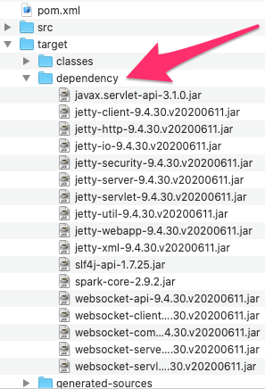
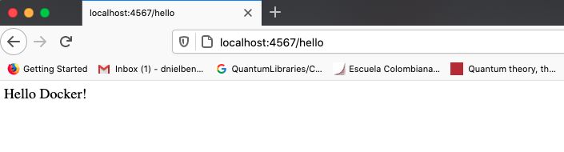
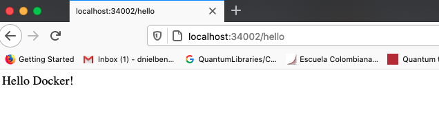

# TALLER DE DE MODULARIZACIÓN CON VIRTUALIZACIÓN E INTRODUCCIÓN A DOCKER Y A AWS

En este taller profundizamos los conceptos de modulación por medio de virtualización usando Docker y AWS.

Pre requisitos

1. El estudiante conoce Java, Maven
2. El estudiante sabe desarrollar aplicaciones web en Java
3. Tiene instalado Docker es su máquina

## DESCRIPCIÓN

El taller consiste en crear una aplicación web pequeña usando el micro-framework de Spark java (http://sparkjava.com/). Una vez tengamos esta aplicación procederemos a construir un container para docker para la aplicación y los desplegaremos y configuraremos en nuestra máquina local. Luego, cerremos un repositorio en DockerHub y subiremos la imagen al repositorio. Finalmente, crearemos una máquina virtual de en AWS, instalaremos Docker , y desplegaremos el contenedor que acabamos de crear.

### **Primera parte crear la aplicación web**

1. Cree un proyecto java usando maven.
2. Cree la clase principal

~~~
package co.edu.escuelaing.sparkdockerdemolive;

public class SparkWebServer {

    public static void main(String... args){
          port(getPort());
          get("hello", (req,res) -> "Hello Docker!");
    }

    private static int getPort() {
        if (System.getenv("PORT") != null) {
            return Integer.parseInt(System.getenv("PORT"));
        }
        return 4567;
    }

}
~~~

3. Importe las dependencias de spark Java en el archivo pom

~~~
<dependencies>
<!-- https://mvnrepository.com/artifact/com.sparkjava/spark-core -->
<dependency>
<groupId>com.sparkjava</groupId>
<artifactId>spark-core</artifactId>
<version>2.9.2</version>
</dependency>
</dependencies>
~~~

4. Asegúrese que el proyecto esté compilando hacia la versión 8 de Java

~~~
<properties>
<project.build.sourceEncoding>UTF-8</project.build.sourceEncoding>
<maven.compiler.source>8</maven.compiler.source>
<maven.compiler.target>8</maven.compiler.target>
</properties>
~~~

5. Asegúrese que el proyecto este copiando las dependencias en el directorio target al compilar el proyecto. Esto es necesario para poder construir una imagen de contenedor de docker usando los archivos ya compilados de java. Para hacer esto use el purgan de dependencias de Maven.

~~~
<!-- build configuration -->
<build>
<plugins>
<plugin>
<groupId>org.apache.maven.plugins</groupId>
<artifactId>maven-dependency-plugin</artifactId>
<version>3.0.1</version>
<executions>
<execution>
<id>copy-dependencies</id>
<phase>package</phase>
<goals><goal>copy-dependencies</goal></goals>
</execution>
</executions>
</plugin>
</plugins>
</build>
~~~

6. Asegúrese que el proyecto compila

`$> mvn clean install`

7. Asegúrese que las dependencias están en el directorio target y que continentemente las dependencia, es decir las librerías necesarias para correr en formato jar. En este caso solo son las dependencias necesarias para correr SparkJava.

8. Ejecute el programa invocando la máquina virtual de Java desde la línea de comandos y acceda la url *http:localhost:4567/hello:*

`java -cp "target/classes:target/dependency/*" co.edu.escuelaing.sparkdockerdemolive.SparkWebServer`

Debería verse algo así:

### **Segunda Parte: crear imagen para docker y subirla**

1. En la raíz de su proyecto cree un archivo denominado Dockerfile con el siguiente contenido:

~~~
FROM openjdk:8

WORKDIR /usrapp/bin

ENV PORT 6000

COPY /target/classes /usrapp/bin/classes
COPY /target/dependency /usrapp/bin/dependency

CMD ["java","-cp","./classes:./dependency/*","co.edu.escuelaing.sparkdockerdemolive.SparkWebServer"]
~~~

2. Usando la herramienta de línea de comandos de Docker construya la imagen:

`docker build --tag dockersparkprimer .`

3. Revise que la imagen fue construida

`docker images`

Debería ver algo así:

%> docker images

| REPOSITORY | TAG | IMAGE ID | CREATED | SIZE |
| - | - | - | - | - |
| dockersparkprimer | latest | 0c5dd4c040f2 | 49 seconds ago | 514MB |
| openjdk | 8 | db530b5a3ccf | 39 hours ago | 511MB |

4. A partir de la imagen creada cree tres instancias de un contenedor docker independiente de la consola (opción “-d”) y con el puerto 6000 enlazado a un puerto físico de su máquina (opción -p):

docker run -d -p 34000:6000 --name firstdockercontainer dockersparkprimer

docker run -d -p 34001:6000 --name firstdockercontainer2 dockersparkprimer

docker run -d -p 34002:6000 --name firstdockercontainer3 dockersparkprimer

5. Asegúrese que el contenedor está corriendo

`docker ps`

Debería ver algo así:

%> docker ps

6. Acceda por el browser a http://localhost:34002/hello, o a http://localhost:34000/hello, o a http://localhost:34001/hello para verificar que están corriendo.

7. Use docker-compose para generar automáticamente una configuración docker, por ejemplo un container y una instancia a de mongo en otro container. Cree en la raíz de su directorio el archivo docker-compose.yml con le siguiente contenido:

~~~
version: '2'

services:
    web:
        build:
            context: .
            dockerfile: Dockerfile
        container_name: web
        ports:
            - "8087:6000"
    db:
        image: mongo:3.6.1
        container_name: db
        volumes:
            - mongodb:/data/db
            - mongodb_config:/data/configdb
        ports:
            - 27017:27017
        command: mongod
        
volumes:
    mongodb:
    mongodb_config:
~~~

8. Ejecute el docker compose:

`docker-compose up -d`

hola